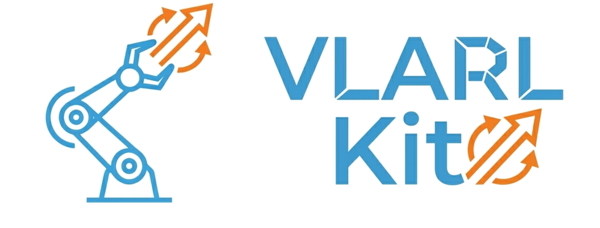
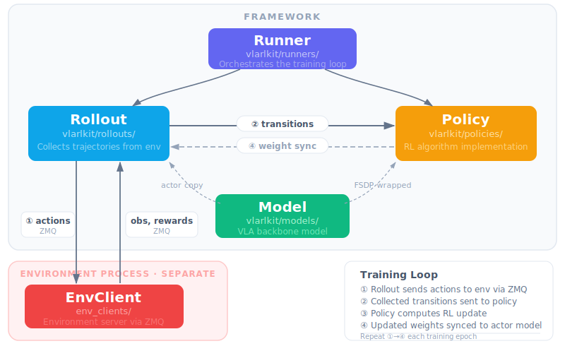

<p align="center">
  
</p>

# VLARLKit: An elegant PyTorch VLA-RL library

An elegant and researcher-friendly RL library for Vision-Language-Action (VLA) models.

<p align="center">
  
</p>

## ✨ Features

- **Simple and clear implementation** — cleanly separated policy, rollout, runner, and model layers with minimal abstraction; easy to read, modify, and extend for research purposes
- **Environment-decoupled architecture** — environments run as independent processes via ZMQ, eliminating dependency conflicts between different benchmark simulators
- **Async off-policy training** — supports asynchronous off-policy training, enabling non-blocking data collection alongside model updates

## 🧩 Supported Algorithms, Base Models, and Benchmarks (Keeping progress)

| Category | Supported |
|---|---|
| **RL Algorithms** | [PPO](https://arxiv.org/abs/1707.06347) (on-policy), [DSRL](https://arxiv.org/pdf/2506.15799) (off-policy), [RLT](https://www.pi.website/download/rlt.pdf) (off-policy) |
| **Base Models** | [π₀.₅](https://github.com/Physical-Intelligence/openpi) |
| **Benchmarks** | [LIBERO](https://github.com/Lifelong-Robot-Learning/LIBERO), [ManiSkill](https://github.com/haosulab/ManiSkill)|

## 📦 Installation

### 1. Main Library

We use [uv](https://docs.astral.sh/uv/) to manage Python dependencies. See the [uv installation instructions](https://docs.astral.sh/uv/getting-started/installation/) to set it up. Once uv is installed, run the following to set up the environment:

```bash
git clone https://github.com/VLARLKit/VLARLKit.git
cd VLARLKit
module load git-lfs
GIT_LFS_SKIP_SMUDGE=1 uv sync
uv pip install -e .
# Apply the transformers library patches for openpi
cp -r .venv/lib/python3.11/site-packages/openpi/models_pytorch/transformers_replace/* .venv/lib/python3.11/site-packages/transformers/
```

### 2. Benchmarks (choose one/more you need)

The environment client runs in a **separate** Python environment with its own dependencies. This avoids dependency conflicts between the simulator and the training stack.

Install scripts for each benchmark are located in the `third_party/` directory. Run the one you need:

```bash
# LIBERO
bash third_party/install_libero.sh

# ManiSkill
bash third_party/install_maniskill.sh
```

### 🚀 Quick Start

RL process is typically performing on a SFT model. So you need to download such an SFT model first.
We highly recommend you to use models from RLinf community.

```bash
# download sft openpi model
cd $SCRATCH
module load git-lfs
git-lfs clone https://huggingface.co/RLinf/RLinf-Pi05-LIBERO-SFT
git-lfs clone https://huggingface.co/RLinf/RLinf-Pi05-ManiSkill-25Main-SFT

# download tokenizer of openpi model
mkdir $HOME/.cache/openpi/big_vision
wget -O $HOME/.cache/openpi/big_vision/paligemma_tokenizer.model \
  "https://storage.googleapis.com/big_vision/paligemma_tokenizer.model"
```

Then, change the ``model_path`` and ``assets_dir`` in config file (examples/configs/libero_spatial_ppo_pi05.yaml) to your path.
For example:
```yaml
model:
  model_path: "<your download path>/RLinf-Pi05-LIBERO-SFT"
  data:
    assets_dir: "<your download path>/RLinf-Pi05-LIBERO-SFT"
```

Now, you can lanuch the script to run!

```bash
bash examples/run_onpolicy_rl.sh
```

## 📋 TODO

- [x] Add ManiSkill benchmark support
- [ ] Add GRPO algorithm support
- [x] Add off-policy asynchronous training support
- [ ] Add OpenVLA base model support
- [ ] Add offline and model-based VLA methods support

## 🙏 Acknowledgements
We borrow some good designs from [RLinf](https://github.com/RLinf/RLinf). The model integration and environment module implementations are primarily adapted from RLinf. We thank the RLinf team for their foundational work.

# 📄 License
This project is licensed under the MIT License (see LICENSE file).

Some source files are derived from Apache-2.0 licensed projects. The original copyright notices are preserved in those files.

